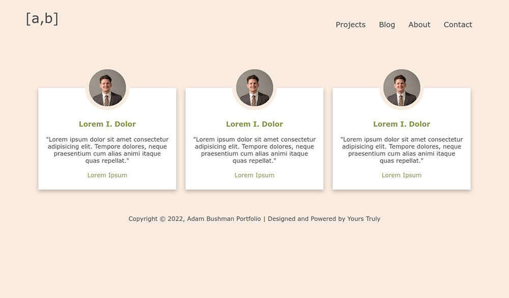

# Portfolio References Page

Professional resumes often sport a small section for professional references, who are seldom contacted during a hiring process. Instead, I envisioned a section of my portfolio that would capture the spirit of this component while recognizing how people realistically interact with it.

## Description

My vision for a portfolio website includes a nice section for professional references that would feature a photo, link to their LinkedIn page, and a power statement about myself displayed in a beautiful format.
I took some inspiration from the web and decided to shoot for something like this:

I approached this little project as a chance to test my HTML and CSS skills by creating something from scratch. Take a look at the source code used for this project in the repository. For a full breakdown of what I did and how, visit the blog post below.

## Blog Post
[Porftolio References Blog Post](https://www.adam-bushman.com/blog_posts/blog_portfolio-references_002.html)